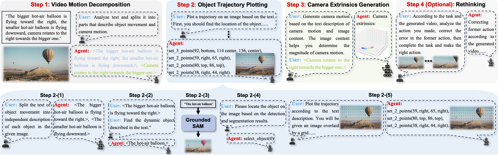

<div align="center">
  <!-- Project Title -->
  <h1>
    MotionAgent: Fine-grained Controllable Video Generation via<br>
    Motion Field Agent
  </h1>
  <!-- Conference Info -->
  <p><em>International Conference on Computer Vision, ICCV 2025.</em></p>
  <!-- Project Badges -->
  <p>
    <a href="https://arxiv.org/abs/2502.03207">
      
    </a>
    <a href="https://huggingface.co/leoisufa/MotionAgent">
      
    </a>
  </p>
</div>


<div align="center">
  <strong>Xinyao Liao<sup>1,2</sup></strong>,
  <strong>Xianfang Zeng<sup>2</sup></strong>,
  <strong>Liao Wang<sup>2</sup></strong>,
  <strong>Gang Yu<sup>2*</sup></strong>,
  <strong>Guosheng Lin<sup>1*</sup></strong>,
  <strong>Chi Zhang<sup>3</sup></strong>
  <br><br>
  <b>
    <sup>1</sup> Nanyang Technological University 
    <sup>2</sup> StepFun 
    <sup>3</sup> Westlake University
  </b>
</div>

## 🧩 Overview
<p align="center">
  
</p>

MotionAgent is a novel framework that enables **fine-grained motion control** for text-guided image-to-video generation. At its core is a **motion field agent** that parses motion information in text prompts and converts it into explicit *object trajectories* and *camera extrinsics*. These motion representations are analytically integrated into a unified optical flow, which conditions a diffusion-based image-to-video model to generate videos with precise and flexible motion control. An optional rethinking step further refines motion alignment by iteratively correcting the agent’s previous actions.

## 🎥 Demo
<p align="center">
  <a href="https://www.youtube.com/watch?v=O9WW2UpXsAI" target="_blank">
    
  </a>
  <br>
  <em>Click the image above to watch the full video on YouTube 🎬</em>
</p>

## 🛠️ Dependencies and Installation  
Follow the steps below to set up **MotionAgent** and run the demo smoothly 💫
### 🔹 1. Clone the Repository  
Clone the official GitHub repository and enter the project directory:  
```bash
git clone https://github.com/leoisufa/MotionAgent.git
cd MotionAgent
```
### 🔹 2. Environment Setup
```bash
# Create and activate conda environment
conda create -n motionagent python==3.10 -y
conda activate motionagent

# Install PyTorch with CUDA 12.4 support
pip install torch==2.4.1 torchvision==0.19.1 torchaudio==2.4.1 --index-url https://download.pytorch.org/whl/cu124

# Install project dependencies
pip install -r requirements.txt
```
### 🔹 3. Install Grounded-Segment-Anything Dependencies
MotionAgent relies on external segmentation and grounding models.
Follow the steps below to install [Grounded-Segment-Anything](https://github.com/IDEA-Research/Grounded-Segment-Anything):
```bash
# Navigate to models directory
cd models

# Clone the Grounded-Segment-Anything repository
git clone https://github.com/IDEA-Research/Grounded-Segment-Anything.git

# Enter the cloned directory
cd Grounded-Segment-Anything

# Install Segment Anything
python -m pip install -e segment_anything

# Install Grounding DINO
pip install --no-build-isolation -e GroundingDINO
```

### 🔹 4. Install Metric3D Dependencies
MotionAgent relies on an external monocular depth estimation model.
Follow the steps below to install [Metric3D](https://github.com/YvanYin/Metric3D):
```bash
# Navigate to models directory
cd models

# Clone the Grounded-Segment-Anything repository
git clone https://github.com/YvanYin/Metric3D.git
```

## 🧱 Download Models  

To run **MotionAgent**, please download all pretrained and auxiliary models listed below, and organize them under the `ckpts/` directory as shown in the example structure.  

### 1️⃣ **Optical Flow ControlNet Weights**  
Download from  
👉 [Hugging Face (MotionAgent)](https://huggingface.co/leoisufa/MotionAgent)  
and place the files in ckpts/controlnet.

### 2️⃣ **Stable Video Diffusion**  
Download from  
👉 [Hugging Face (MOFA-Video-Hybrid)](https://huggingface.co/MyNiuuu/MOFA-Video-Hybrid/tree/main/ckpts/mofa/stable-video-diffusion-img2vid-xt-1-1)  
and save the model to ckpts/stable-video-diffusion-img2vid-xt-1-1

### 3️⃣ **Grounding DINO**  
Download the grounding model checkpoint using the command below:  
```bash
wget https://github.com/IDEA-Research/GroundingDINO/releases/download/v0.1.0-alpha/groundingdino_swint_ogc.pth
```
Then place it directly under ckpts/groundingdino_swint_ogc.pth

### 4️⃣ **Metric Depth Estimator** 
Download from  
👉 [Hugging Face (Metric3d)](https://huggingface.co/onnx-community/metric3d-vit-small)  
and place the files in ckpts/metric_depth_vit_small_800k.pth.

### 5️⃣ **Segment Anything**
Download the segmentation model using:
```bash
wget https://dl.fbaipublicfiles.com/segment_anything/sam_vit_h_4b8939.pth
```
Then place it under ckpts/sam_vit_h_4b8939.pth.

After all downloads and installations, your ckpts folder should look like this:  

```shell
ckpts/
├── controlnet/
├── stable-video-diffusion-img2vid-xt-1-1/
├── groundingdino_swint_ogc.pth
├── metric_depth_vit_small_800k.pth
└── sam_vit_h_4b8939.pth
```

## 🚀 Running the Demos
ToDo

## 🔗 BibTeX
If you find [MotionAgent](https://arxiv.org/abs/2502.03207) useful for your research and applications, please cite using this BibTeX:
```BibTeX
@article{liao2025motionagent,
  title={Motionagent: Fine-grained controllable video generation via motion field agent},
  author={Liao, Xinyao and Zeng, Xianfang and Wang, Liao and Yu, Gang and Lin, Guosheng and Zhang, Chi},
  journal={arXiv preprint arXiv:2502.03207},
  year={2025}
}
```

## 🙏 Acknowledgements
We thank the following prior art for their excellent open source work: 
- [MOFA-Video](https://github.com/MyNiuuu/MOFA-Video)
- [AppAgent](https://github.com/TencentQQGYLab/AppAgent)
- [Grounded-Segment-Anything](https://github.com/IDEA-Research/Grounded-Segment-Anything)
- [Metric3D](https://github.com/YvanYin/Metric3D)